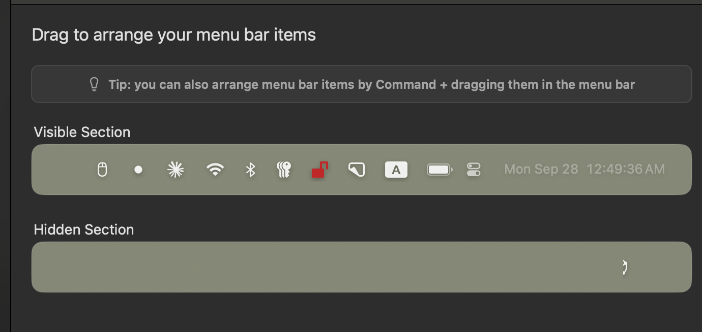

# Glint: Customizable UI Spec

As of 28 September 2026 (version 0.11).

## Summary

Glint gets a Settings pane where the user drags the overlay's controls between a **Visible** row and a **Hidden** row, and reorders them within each row. It copies the pattern from Ice, the Mac menu bar manager: two tinted wells that preview the real items, with drag between them.



The overlay capsule has grown a control per feature (mic, screenshot, Glance, Ghost, follow-up and more). Most people use three or four of them. Hiding the rest shrinks the capsule and cuts visual noise during calls, without removing any feature: hidden controls stay one click away in an overflow menu and keep their keyboard shortcuts.

## What can be customized

Only the 1a Island capsule in the Full layout is customizable in this version. Nine of its items can move and hide; four stay put because Glint doesn't work without them.

| Item | Id | Default | Can hide | Notes |
| --- | --- | --- | --- | --- |
| Logo | `logo` | Locked, first | No | Drag handle, panel toggle, reset position. The only way to move the overlay by pointer. |
| Status | `status` | Locked, after logo | No | "Ready" or the recording dot and clock. Recording must always be readable. |
| Activity | `activity` | Visible | Yes | Me/Them voice dots, "Answering…", "Not listening". The logo still pulses while answering when this is hidden. |
| Mode | `mode` | Visible | Yes | Mode chip and its menu. |
| Screen context | `screen` | Visible | Yes | Toggle. |
| Invisible mode | `invisible` | Visible | Yes | Toggle. Keeps its hotkey when hidden. |
| Room mode | `room` | Visible | Yes | Toggle. |
| Speaker labels | `labels` | Visible | Yes | Toggle. Its new-voice badge moves to the Meeting options button when hidden. |
| Session | `session` | Visible | Yes | One unit: Start + Resume when idle, Pause + Stop when live. Keeps ⌘⇧\\ and the menu bar. |
| Chat box | `chat` | Visible | Yes | Toggle for the panel. |
| Ask | `ask` | Visible | Yes | Ask/Stop pill. Keeps ⌘↩. |
| Divider | `divider-1` to `divider-4` | Visible | Yes | Draggable separators, see below. |
| Meeting options | `options` | Locked, last | No | Holds the hidden items, so it can't be hidden itself. |

**Dividers become items.** Today's four separators between groups turn into four draggable divider items, so the default layout matches the current capsule exactly. At render, a divider at the end of the movable run is dropped, and a run of dividers shows as one. A leading divider stays, since it separates Status from the first item.

**Default order** (matches 0.11): `logo`, `status`, `activity` | `mode` | `screen`, `invisible`, `room`, `labels` | `session` | `chat`, `ask`, `options`.

**Failure state is unchanged.** While the capsule shows an AI or audio failure, it drops Activity, Mode and the four toggles wherever they sit, as it does today, and puts the failure line and Dismiss right after Status. Session, Chat and Ask stay in their chosen order if visible. Meeting options is hidden during a failure, as today, so hidden controls come back once it's dismissed.

## Settings pane

A new Settings page, **Overlay**, sits between General and AI in the sidebar. It holds one section: two wells the user drags controls between, with changes applied to the live capsule on every drop and no Save button.

**Layout, top to bottom**

1. Title: "Drag to arrange the overlay's controls".
2. Tip bar, grey with a bulb icon: "Hidden controls stay in Meeting options and keep their shortcuts."
3. **Shown on the overlay** well. Previews the capsule in order: Logo and Status dimmed at the left, Meeting options dimmed at the right, the movable items between them.
4. **In Meeting options** well. The hidden items in order. Empty state: "Drag controls here to tuck them away."
5. **Restore default** button at the bottom right, a plain button, disabled when the layout is already the default.

**Look.** Both wells use the overlay's dark glass tokens in either Settings theme, since the overlay is always dark, so the preview matches what's on screen. Items render with the capsule's own classes (`circle`, `chip`, `pill`) in their idle look: Session shows the mic and resume circles, Ask shows "Ask" with its hotkey. Preview items don't act on click. The visible well wraps onto a second line if it runs past the 680 px content column.

**Interactions**

| Input | Result |
| --- | --- |
| Drag an item within a well | Reorders it; the other items make room while dragging, as in AI → Providers |
| Drag an item to the other well | Shows or hides it at the drop position |
| Drag onto a locked item | Lands next to it, never before Logo/Status or after Meeting options |
| Hover an item | Tooltip with its name; locked ones say "Always shown" |
| Focus an item, ← / → | Moves it one place within its well |
| Focus an item, ↑ / ↓ | Moves it to the other well, at the same index or the end |
| Any move | Saves at once; an `aria-live` line reads e.g. "Screen context moved to Meeting options, position 2" |
| Restore default | Puts back the 0.11 order with nothing hidden |

Drag uses native HTML5 drag and drop, the same pattern as the provider list in `Settings.tsx`; no new dependency.

## Behavior

Hidden controls move into Meeting options rather than disappearing, so no feature is ever out of reach.

- **Where hidden items go.** Meeting options gets a first row under its header, "More controls", with the hidden items in their saved order. They are the real, working buttons, same look as on the capsule. The row is absent when nothing is hidden.
- **Mode when hidden** becomes a `<select>` row in that sheet, like Spoken language, instead of a chip with a nested menu.
- **Clicking a hidden toggle** keeps the sheet open, so the user sees the new state.
- **Hotkeys and the menu bar** are unaffected. Hiding Ask, Session or Invisible mode never removes ⌘↩, ⌘⇧\\ or the menu bar items.
- **Onboarding.** While a practice step teaches an item (`s.teach` is start, stop, ask or invisible), that item shows at the end of the capsule even if hidden, then goes back when the step ends.
- **Badges.** The new-voice badge on Speaker labels moves to the Meeting options button while Speaker labels is hidden.
- **Room mode** without a recorded voice opens Settings → Voice from either place, as today.
- **Size.** The capsule shrinks to fit. Main already sizes the bar window to what the page reports and keeps it centred, so this needs no window code. The 690 px panel is unchanged.
- **Minimum.** Everything movable can be hidden; the smallest capsule is Logo, Status and Meeting options.
- **Layouts.** Glance and Ghost ignore this setting. It only shapes the Full-layout capsule.
- **Reset.** Restore default on the Overlay page, and General's "Reset all settings" also resets it.

## Data model and persistence

One new persisted key, `capsule`, holds two ordered id lists. Locked items are never stored.

```ts
// src/shared/state.ts
export const CAPSULE_ITEMS = [
  'activity', 'divider-1', 'mode', 'divider-2', 'screen', 'invisible', 'room', 'labels',
  'divider-3', 'session', 'divider-4', 'chat', 'ask',
] as const
export type CapsuleItem = (typeof CAPSULE_ITEMS)[number]

// in Persisted
capsule: { shown: CapsuleItem[]; hidden: CapsuleItem[] }

// default
capsule: { shown: [...CAPSULE_ITEMS], hidden: [] }
```

**Validation.** The `capsule` validator in `state.ts` accepts two arrays of known ids with no id appearing twice across both. A file that fails falls back to the default for this key alone, through the existing lenient `loadPersisted`.

**New controls in later versions.** `loadPersisted` appends any known id missing from both lists to the end of `shown`, so a control added in a future release appears instead of vanishing. `tidyDividers` drops the dividers a layout leaves at the end or doubled.

**Writes.** Every move patches `{ capsule: { shown, hidden } }` with both arrays whole. `capsule` joins `RENDERER_PATCHABLE` in `src/main/index.ts`.

**Check.** One test in `src/shared/state.test.mts`: a missing id is appended to `shown`, a duplicate or unknown id is rejected, and the divider rules hold.

**Files touched:** `src/shared/state.ts`, `src/shared/state.test.mts`, `src/main/index.ts`, `src/renderer/src/ControlBar.tsx`, `src/renderer/src/Settings.tsx`, `src/renderer/src/styles.css`.

## Scope, open questions, acceptance

**Out of scope for this version**

- ⌘-drag to rearrange in the live capsule, as Ice's tip offers. The overlay never takes focus and passes clicks through, so dragging there needs its own design.
- A third "always hidden" well like Ice's. Two states cover Glint's nine items.
- Customizing the chat panel's view tabs, Glance, Ghost or the menu bar menu.
- Per-mode layouts (a different capsule for Job interview than for Sales call).

**Open questions**

- [ ] Should Activity be hideable? The UI toggles doc lists voice activity as something that must stay visible; this spec allows hiding it because the recording clock and logo pulse remain.
- [ ] Page name: a new "Overlay" page, or a section at the top of General?
- [ ] Hidden Mode: a `<select>` row (this spec) or the same chip with its menu inside the sheet?

**Acceptance criteria**

- [ ] With no saved `capsule`, the capsule looks exactly like 0.11.
- [ ] Dragging an item between wells, or pressing ↑/↓ on it, updates the live capsule within one frame of the drop.
- [ ] Every hidden item works from Meeting options' "More controls" row, and its hotkey still works.
- [ ] Logo, Status and Meeting options can't be moved or hidden.
- [ ] No two dividers render side by side, and none at the end of the movable run.
- [ ] A failure still shows the failure line after Status and hides Activity, Mode and the four toggles.
- [ ] Onboarding's practice steps show their taught item even when it is hidden.
- [ ] A state file with a missing id gains it at the end of `shown`; one with a duplicate or unknown id falls back to the default.
- [ ] Restore default and "Reset all settings" both return the 0.11 layout.
