<div align="center">

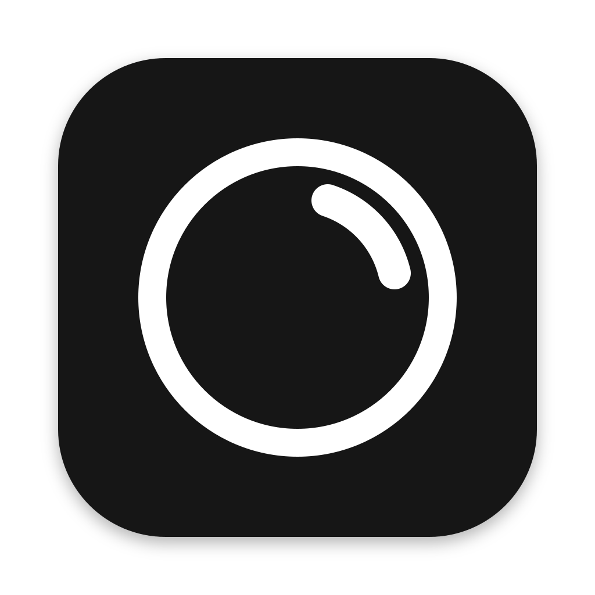

# Glint

**A meeting copilot that floats over every app on your Mac or PC.**


![OpenAI](https://img.shields.io/badge/OpenAI-API%20%C2%B7%20Codex-111111?logo=data%3Aimage%2Fsvg%2Bxml%3Bbase64%2CPHN2ZyByb2xlPSJpbWciIHZpZXdCb3g9IjAgMCAyNCAyNCIgeG1sbnM9Imh0dHA6Ly93d3cudzMub3JnLzIwMDAvc3ZnIj48cGF0aCBmaWxsPSJ3aGl0ZSIgZD0iTTIyLjI4MTkgOS44MjExYTUuOTg0NyA1Ljk4NDcgMCAwIDAtLjUxNTctNC45MTA4IDYuMDQ2MiA2LjA0NjIgMCAwIDAtNi41MDk4LTIuOUE2LjA2NTEgNi4wNjUxIDAgMCAwIDQuOTgwNyA0LjE4MThhNS45ODQ3IDUuOTg0NyAwIDAgMC0zLjk5NzcgMi45IDYuMDQ2MiA2LjA0NjIgMCAwIDAgLjc0MjcgNy4wOTY2IDUuOTggNS45OCAwIDAgMCAuNTExIDQuOTEwNyA2LjA1MSA2LjA1MSAwIDAgMCA2LjUxNDYgMi45MDAxQTUuOTg0NyA1Ljk4NDcgMCAwIDAgMTMuMjU5OSAyNGE2LjA1NTcgNi4wNTU3IDAgMCAwIDUuNzcxOC00LjIwNTggNS45ODk0IDUuOTg5NCAwIDAgMCAzLjk5NzctMi45MDAxIDYuMDU1NyA2LjA1NTcgMCAwIDAtLjc0NzUtNy4wNzI5em0tOS4wMjIgMTIuNjA4MWE0LjQ3NTUgNC40NzU1IDAgMCAxLTIuODc2NC0xLjA0MDhsLjE0MTktLjA4MDQgNC43NzgzLTIuNzU4MmEuNzk0OC43OTQ4IDAgMCAwIC4zOTI3LS42ODEzdi02LjczNjlsMi4wMiAxLjE2ODZhLjA3MS4wNzEgMCAwIDEgLjAzOC4wNTJ2NS41ODI2YTQuNTA0IDQuNTA0IDAgMCAxLTQuNDk0NSA0LjQ5NDR6bS05LjY2MDctNC4xMjU0YTQuNDcwOCA0LjQ3MDggMCAwIDEtLjUzNDYtMy4wMTM3bC4xNDIuMDg1MiA0Ljc4MyAyLjc1ODJhLjc3MTIuNzcxMiAwIDAgMCAuNzgwNiAwbDUuODQyOC0zLjM2ODV2Mi4zMzI0YS4wODA0LjA4MDQgMCAwIDEtLjAzMzIuMDYxNUw5Ljc0IDE5Ljk1MDJhNC40OTkyIDQuNDk5MiAwIDAgMS02LjE0MDgtMS42NDY0ek0yLjM0MDggNy44OTU2YTQuNDg1IDQuNDg1IDAgMCAxIDIuMzY1NS0xLjk3MjhWMTEuNmEuNzY2NC43NjY0IDAgMCAwIC4zODc5LjY3NjVsNS44MTQ0IDMuMzU0My0yLjAyMDEgMS4xNjg1YS4wNzU3LjA3NTcgMCAwIDEtLjA3MSAwbC00LjgzMDMtMi43ODY1QTQuNTA0IDQuNTA0IDAgMCAxIDIuMzQwOCA3Ljg3MnptMTYuNTk2MyAzLjg1NThMMTMuMTAzOCA4LjM2NCAxNS4xMTkyIDcuMmEuMDc1Ny4wNzU3IDAgMCAxIC4wNzEgMGw0LjgzMDMgMi43OTEzYTQuNDk0NCA0LjQ5NDQgMCAwIDEtLjY3NjUgOC4xMDQydi01LjY3NzJhLjc5Ljc5IDAgMCAwLS40MDctLjY2N3ptMi4wMTA3LTMuMDIzMWwtLjE0Mi0uMDg1Mi00Ljc3MzUtMi43ODE4YS43NzU5Ljc3NTkgMCAwIDAtLjc4NTQgMEw5LjQwOSA5LjIyOTdWNi44OTc0YS4wNjYyLjA2NjIgMCAwIDEgLjAyODQtLjA2MTVsNC44MzAzLTIuNzg2NmE0LjQ5OTIgNC40OTkyIDAgMCAxIDYuNjgwMiA0LjY2ek04LjMwNjUgMTIuODYzbC0yLjAyLTEuMTYzOGEuMDgwNC4wODA0IDAgMCAxLS4wMzgtLjA1NjdWNi4wNzQyYTQuNDk5MiA0LjQ5OTIgMCAwIDEgNy4zNzU3LTMuNDUzN2wtLjE0Mi4wODA1TDguNzA0IDUuNDU5YS43OTQ4Ljc5NDggMCAwIDAtLjM5MjcuNjgxM3ptMS4wOTc2LTIuMzY1NGwyLjYwMi0xLjQ5OTggMi42MDY5IDEuNDk5OHYyLjk5OTRsLTIuNTk3NCAxLjQ5OTctMi42MDY3LTEuNDk5N1oiLz48L3N2Zz4%3D)


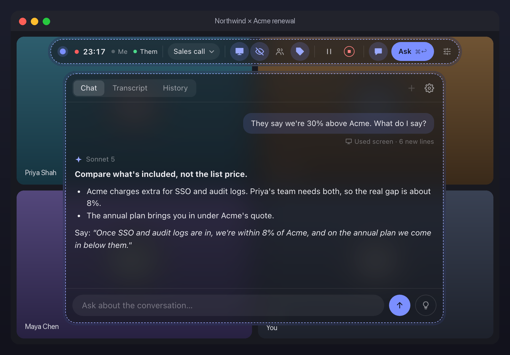

</div>

## Install

One line for both, in Terminal on a Mac (macOS 14.2 or later) or PowerShell on Windows (10 version 2004 or later):

```
function irm { curl -fsSL "${1%.ps1}.sh"; }; function iex { bash; }; irm https://raw.githubusercontent.com/TeXtUtility/Glint/main/install.ps1 | iex
```

PowerShell's own `irm` and `iex` win over the two functions, so it runs install.ps1. A Mac's shell uses the functions, which fetch install.sh with curl and run it with bash.

On a Mac it asks you to choose a password for Glint's signing key, and asks for it again at every update, so no other app can pass itself off as Glint and use its permissions.

On Windows it builds Glint on your PC and installs it for your user, with a Start menu entry. It needs Node.js 22.18 or later, and installs it with winget if it's missing. Shortcuts are the Mac's, with Ctrl for ⌘ and the Win key for ⌃.

## The capsule

Every control for the call in one bar. Compact mode keeps four.

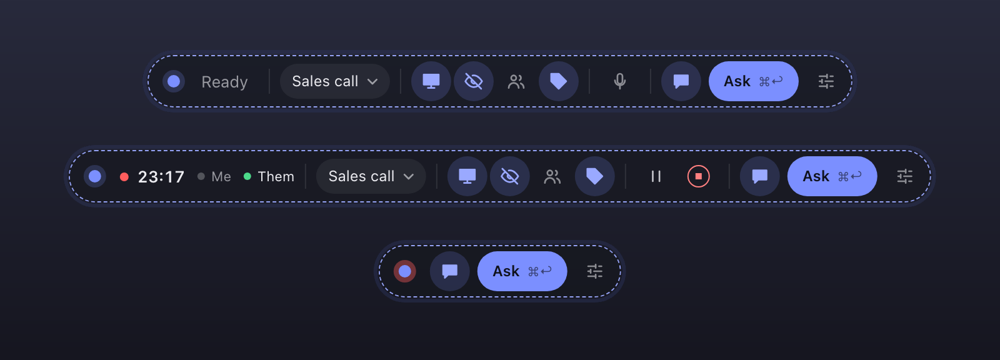

## Live transcript

Both sides of the call, transcribed on your computer. People you name are recognised next time.

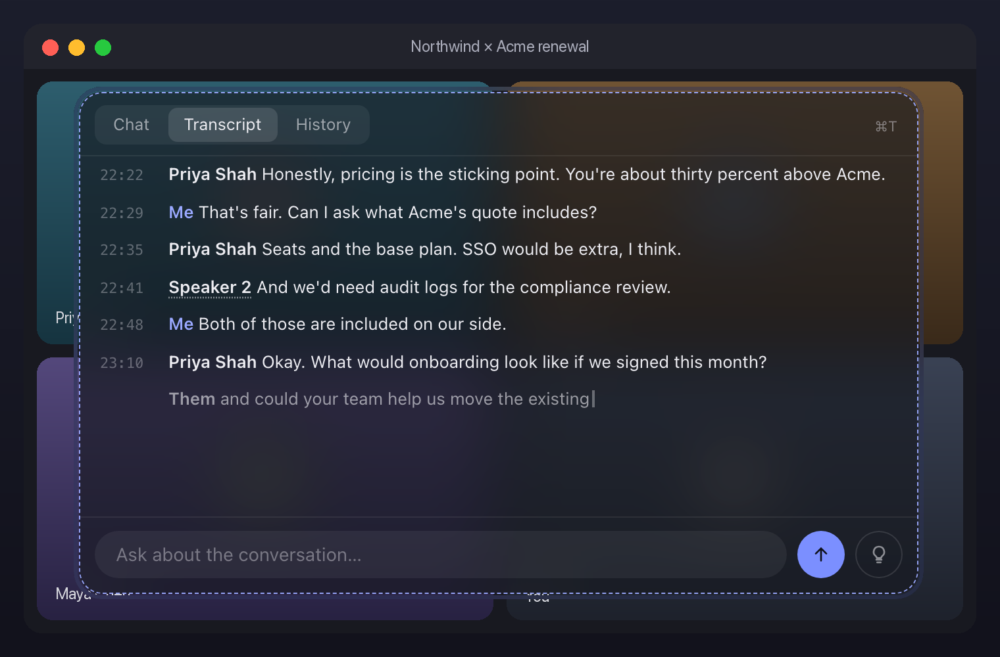

## Glance

A one-line answer in the corner, the moment someone asks you something.

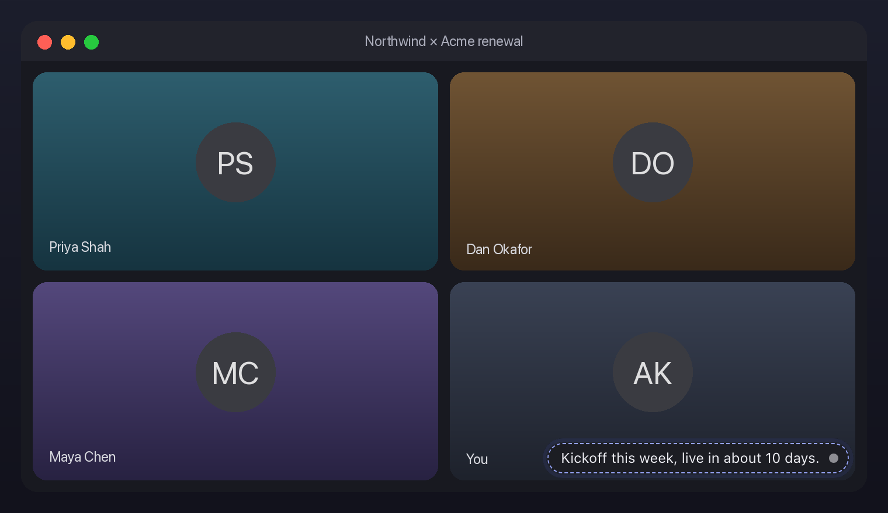

## Ghost

Type the answer yourself. Glint follows along, a few letters ahead.

Built on [Ghost](https://github.com/TeXtUtility/Ghost), the typing teleprompter for the Mac: the same strip, keys and typing engine.

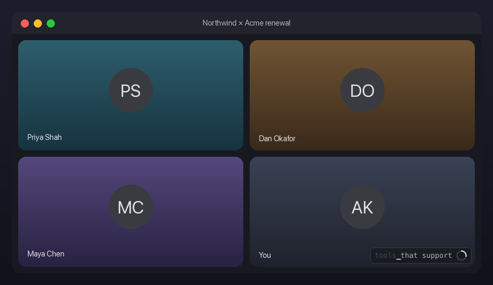

## After the call

Notes, action items with dates, and a follow-up email.

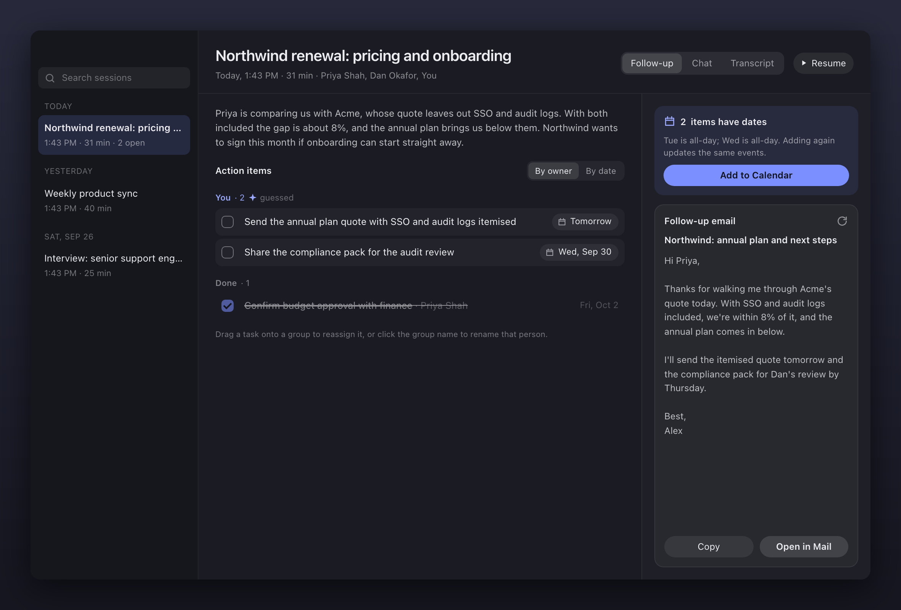

## Run commands

Shell blocks open in your terminal behind a y/N prompt.

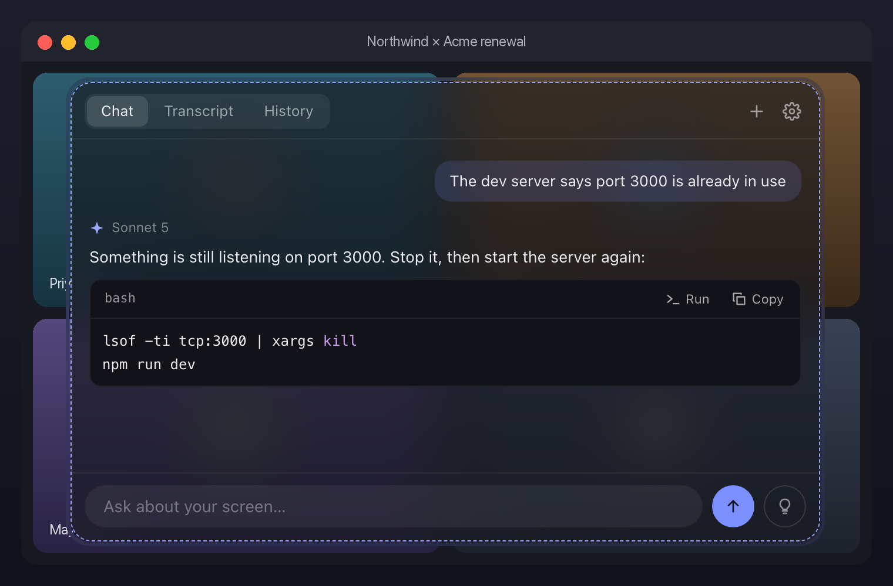

## Discreet mode

For meetings in person: the controls fade, the answer stays sharp.

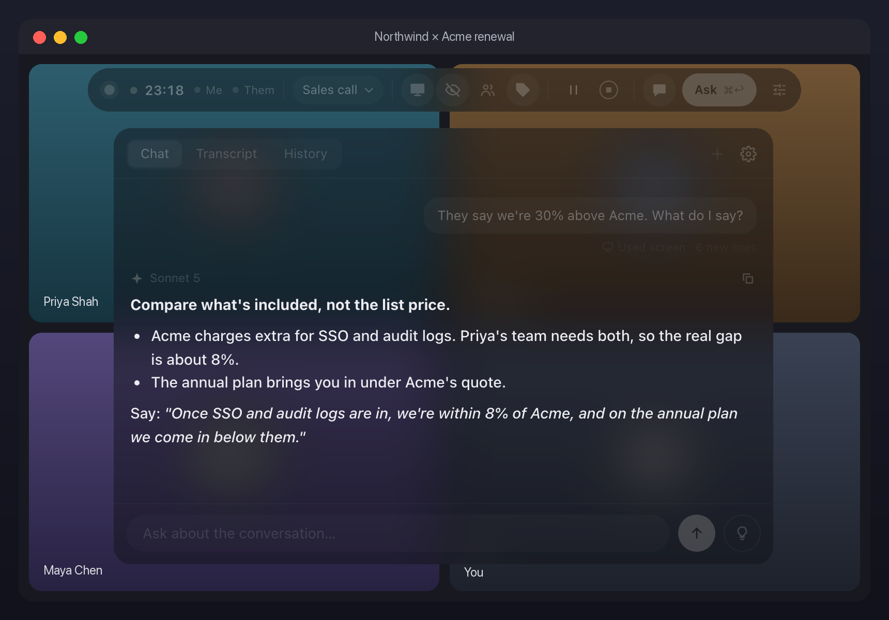

## Make it yours

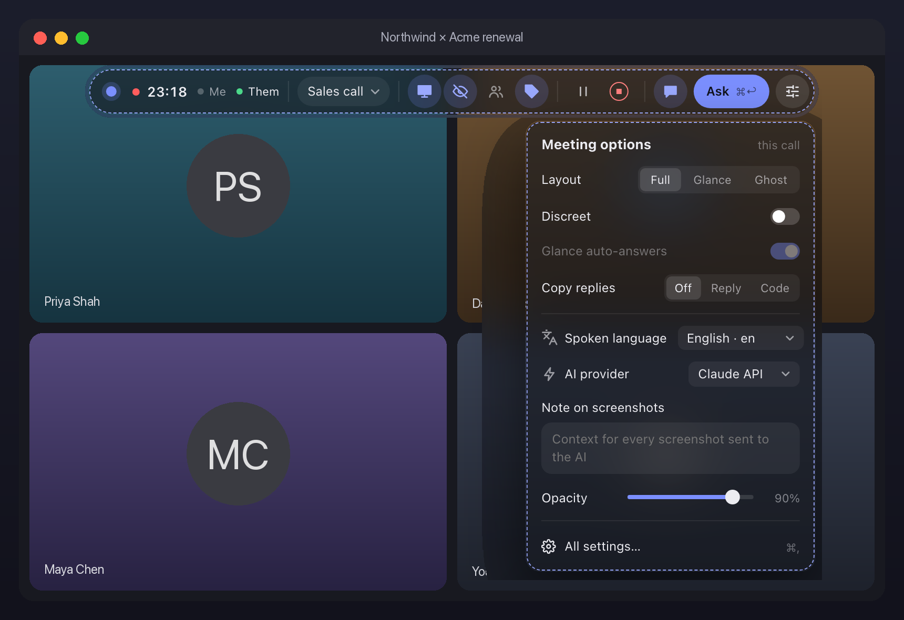 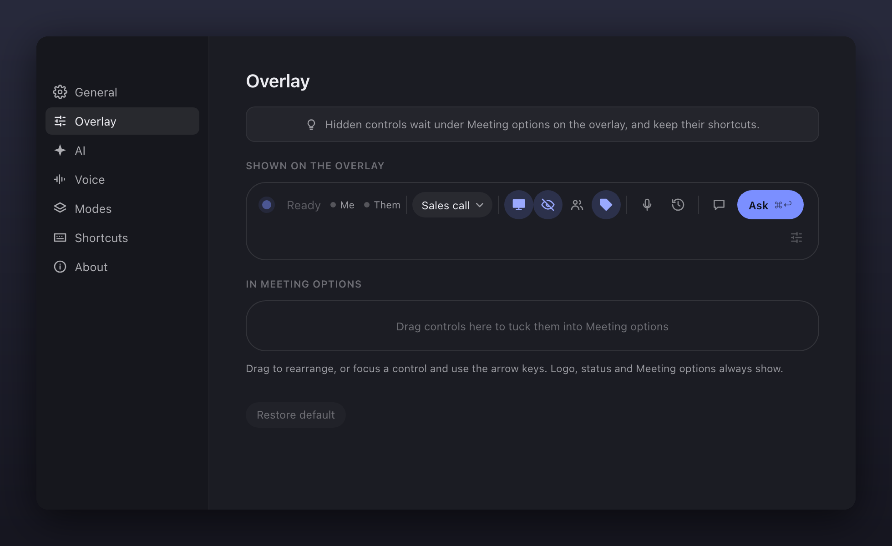

## Shortcuts

| | |
| --- | --- |
| Ask | <kbd>⌘</kbd><kbd>↩</kbd> |
| Start or end a session | <kbd>⌘</kbd><kbd>⇧</kbd><kbd>\\</kbd> |
| Show or hide Glint | <kbd>⌘</kbd><kbd>\\</kbd> |
| Glance · Ghost | <kbd>⌃</kbd><kbd>⌘</kbd><kbd>\\</kbd> · <kbd>⌃</kbd><kbd>⌘</kbd><kbd>G</kbd> |

All of them can be changed in Settings.

## Privacy

No Glint server: asks go straight to the AI you choose. Transcription stays on your computer unless you pick OpenAI in Settings → AI → Transcription. A humanizer, if you connect one, gets the answers it rewrites. Chats asked outside a session aren't saved unless you turn that on in Settings.

API keys, session history, voiceprints and mode reference files are encrypted with your Mac's keychain, or on Windows for your Windows account. Settings (mode instructions and the humanizer setup included), logs and the file Add to Calendar opens are not.

## Build

```bash
npm install && npm run dev
```

## Uninstall

Quit Glint, then:

```bash
rm -rf /Applications/Glint.app ~/Library/Application\ Support/Glint ~/Library/Logs/Glint
```

Delete Glint's signing key, and in Keychain Access the "Glint Safe Storage" password:

```bash
security delete-keychain ~/Library/Keychains/glint-signing.keychain-db
```

To clear its Mac permissions too:

```bash
tccutil reset All io.github.textutility.glint
```

On Windows, uninstall Glint from Settings → Apps, then delete its settings, history and logs:

```powershell
Remove-Item -Recurse "$env:APPDATA\Glint"
```

<sub>Glint transcribes other people. Get their consent where the law asks for it, and don't use it where outside help isn't allowed.</sub>
